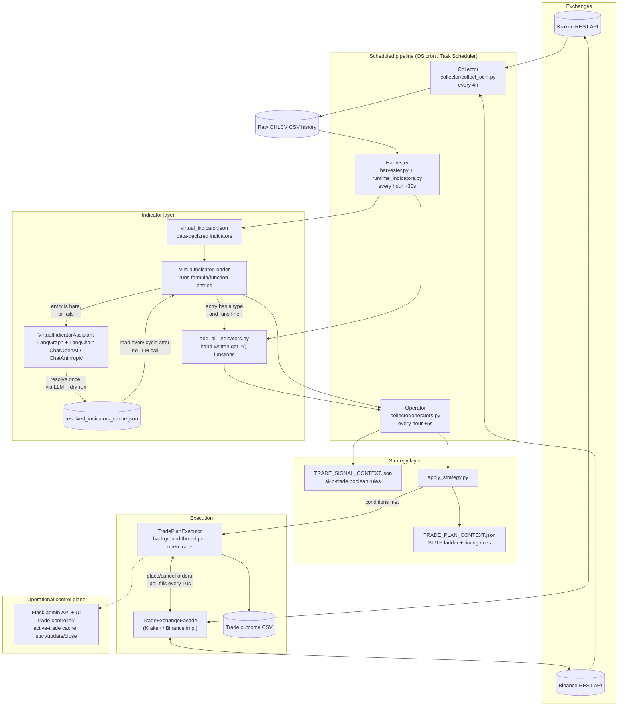
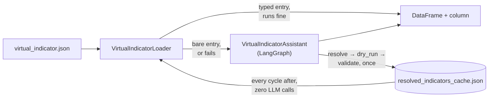

# d-trader: AI-Powered Trading Platform

## Overview

# d-trader

**Algorithmic crypto trading platform with an LLM-assisted indicator layer.**

A multi-exchange (Kraken + Binance) trading system that collects OHLCV candle
data, computes technical indicators over it, evaluates rule-based trade
strategies against those indicators, and manages the full lifecycle of a
position (entry, trailing stop-loss/take-profit, exit) against the exchange's
live order book. Indicators can be declared as data (JSON) instead of code,
and an LLM agent (OpenAI or Anthropic, via LangGraph) writes and validates
the pandas/pandas-ta expression for you the first time an indicator runs,
then caches it so every following cycle is deterministic and LLM-free.

> This is a portfolio writeup of a private production/paper-trading
> codebase. Source is available on request.

---

## Why this exists

Most retail algo-trading side projects stop at "backtest a strategy in a
notebook." This one is built to actually run unattended against a live
exchange: a scheduled collector keeps historical candles current, a
strategy engine re-evaluates entry conditions every hour, and a stateful
executor manages a position's stop-loss/take-profit ladder in a background
thread until it closes — with the human only in the loop to define new
strategies and indicators, not to babysit open trades.

## Architecture



**Scheduling, not services.** There's no message broker or job queue —
Collector, Harvester and Operator are plain Python entry points invoked by
the OS scheduler at fixed intervals (`run_collecting_data.sh`,
`run_operators.sh`, ...). The `TradePlanExecutor` for an open position runs
as a background thread inside the Operator process and polls the exchange
every 10 seconds until the position's stop-loss or take-profit order fills.

**Storage is files, not a database.** Historical OHLCV is append-only CSV
per `<exchange>-<pair>-<resolution>`; strategies and their parameters are
version-controlled JSON under `strategies/<pair>/`; resolved LLM indicator
recipes are cached to `resolved_indicators_cache.json`. This keeps every
strategy change and every indicator the LLM ever invented auditable in git
history — no opaque DB state to reason about.

## The virtual indicator system

The most distinctive piece: instead of every technical indicator requiring
a hand-written `get_*()` function and a redeploy, an indicator can be
declared as **data** in `virtual_indicator.json`, at three levels of
specificity:

**1. Fully specified — a `pandas-ta` formula, evaluated deterministically:**
```json
{
  "indicator-name": "c_rsi10",
  "description": "RSI with 10-period - using pandas-ta",
  "type": "formula",
  "candles": ["H1", "H4", "M30", "H12", "H2"],
  "library": "pandas-ta",
  "alias": "ta",
  "formula": "ta.rsi(df['close'], length=10)",
  "round_to": 4,
  "enabled": true
}
```

**2. Fully specified — reusing an existing hand-written function:**
```json
{
  "indicator-name": "low_rsi14_trendline",
  "description": "Custom RSI trend following indicator based on RSI14 crossing below threshold",
  "type": "function",
  "candles": ["H1", "H4"],
  "indicator-function": "get_low_rsi14_trendline(column='c_rsi14', threshold=30)",
  "enabled": true
}
```

**3. Bare — name + description only, left entirely to the LLM:**
```json
{
  "indicator-name": "rsi_bullish_divergence",
  "description": "Detects bullish RSI divergence: price makes a lower low while RSI14 makes a higher low, over the last 10 candles",
  "candles": ["H1", "H4"],
  "enabled": true
}
```

For case 3, a LangGraph state machine (`core/virtual_indicator_agent.py`)
takes over: the LLM is given tools to inspect the live OHLCV schema, search
`pandas-ta` for a matching function, and — critically — must **dry-run its
own candidate recipe** against a real data sample before it's allowed to
answer. A second node independently re-validates the recipe (checks the
output column exists and isn't all-`NaN`) before it's cached. The same
self-healing path repairs a *fully-specified* entry that throws at runtime
(e.g. a missing library alias), feeding the exact exception back to the LLM
as context.



Net effect: **the LLM is invoked at most once, ever, per indicator +
candle-resolution pair.** Every subsequent cycle reads the cached, validated
recipe and runs it deterministically — no runtime LLM latency or cost on
the trading hot path, only on first use or after an explicit config edit.

Full design writeup: `VI-ASSISTANT-README.md` in the source repo (includes
the compiled LangGraph resolver graph and a sequence diagram of the
resolve/repair/cache flow).

## Strategy definition — rules as data, not code

A strategy is two JSON files per instrument/direction/priority
(e.g. `BTCUSDC-H1-L-10`): a **signal context** (boolean skip-conditions
evaluated against recent candles) and a **plan context** (position sizing,
and a time/price-staged stop-loss & take-profit ladder). Example skip-rule,
evaluated against indicator columns on the last few H1/H4/M30 candles:

```json
{
  "key": "H1__t0_close_diff_with__H1_t1-3_high_less_than_0.4*STD",
  "expression": "H1t0.close > H1t1.high - (H1t0.std_band20 * 0.4) and H1t0.close > H1t2.high - (H1t0.std_band20 * 0.4) and H1t0.close > H1t3.high - (H1t0.std_band20 * 0.4)"
}
```

`H1t0`/`H1t1`/... address the current and previous N candles for that
resolution; the expression is evaluated against a full library of derived
columns (Bollinger bands, RSI, stochastic RSI, candle body/wick ratios,
volatility bands) computed once per cycle. A trade only opens if **none**
of a strategy's ~40 skip-rules fire.

Once open, the plan context drives a time- and price-staged exit — e.g. for
`BTCUSDC-H1-L-10`, the stop-loss tightens from `2.5σ` to `0.25σ` below entry
across nine stages as either price moves favorably or a time threshold
elapses, all re-evaluated by `TradePlanExecutor` every 10 seconds against
live price.

## Indicator library

Hand-written, reused across strategies (`core/add_all_indicators.py`):
Bollinger Bands (`u_band20`/`l_band20`/`std_band20`), SMA(20/50/200),
volume SMA, RSI(14/20) with both EMA and SMA smoothing, RSI-of-RSI (SMA),
Stochastic RSI (%K/%D), and candle-shape features (`green`, `oc` body size,
upper/lower wick length). These are the base columns every strategy
expression and every `formula`/`function`-type virtual indicator builds on.

## Operational control plane

A small Flask service (`trade-controller/`) tracks in-memory state for
currently open trades per account — start/update/close endpoints backed by
Pydantic models (`ActiveTrade`, `CurrentState`), plus a lightweight HTML/JS
admin UI for manually starting, updating or closing a tracked trade and
inspecting active positions. This is the one piece of the system with a
UI; everything upstream (collection, indicator resolution, strategy
evaluation, execution) is headless and scheduler-driven.

## Exchange abstraction

`TradeExchangeFacadeInterface` defines a single contract — fetch enriched
OHLCV, place/edit/cancel single and OCO orders, poll balances, margin and
order state — implemented separately for Kraken (`krakenex`/`pykrakenapi`)
and Binance (`python-binance`), so a strategy, the harvester, and the
executor never talk to an exchange SDK directly.

## Stack

| Layer | Technology |
|---|---|
| Language | Python (pandas, numpy) |
| Exchanges | Kraken (`krakenex`, `pykrakenapi`), Binance (`python-binance`) |
| Indicators | Hand-written pandas + `pandas-ta`/`ta`, resolved via LangGraph/LangChain agent |
| LLM providers | OpenAI (`ChatOpenAI`) and Anthropic (`ChatAnthropic`), swappable per config |
| Control-plane API | Flask + Pydantic |
| Storage | CSV (candle history), JSON (strategies, indicator config, resolved-recipe cache) — file-based and git-diffable, no database |
| Scheduling | OS-level (cron / Windows Task Scheduler) — no message broker or job queue |
| Testing | `pytest` — strategy evaluation, trade-plan P/L math, exchange-facade behavior (`tests/`) |

## Status

Beta, connected live to Kraken; Binance support and multi-strategy
priority ordering (running several strategies per instrument/direction
concurrently) are the most recently active areas of work. Trade-plan
execution, the virtual indicator system, and the collector/harvester
pipeline are running end-to-end; the analytics/reporting web app is still
a TODO.

