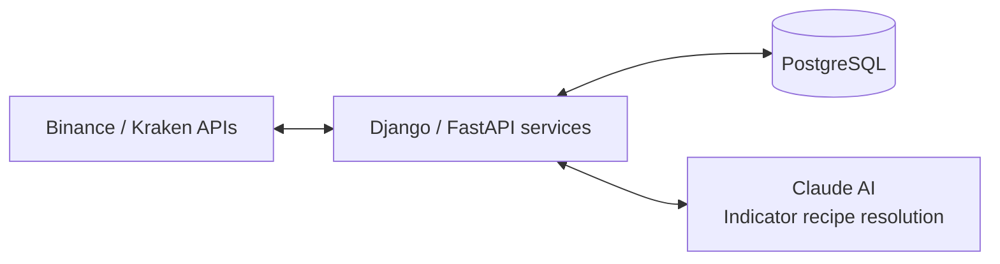

# d-trader: AI-Powered Trading Platform

## Overview

Full-stack algorithmic trading system with LLM-based decision making.

## Features

- Real-time Binance and Kraken API integration
- Multi-service microarchitecture
- Claude AI for indicator recipe resolution
- PostgreSQL data persistence
- Docker containerization

## Architecture

## Tech Stack

Python • Django • FastAPI • PostgreSQL • Docker • LangChain • Claude

## Code Access

Private repository. **[Request access](mailto:your-email@example.com)** or share during interview.
